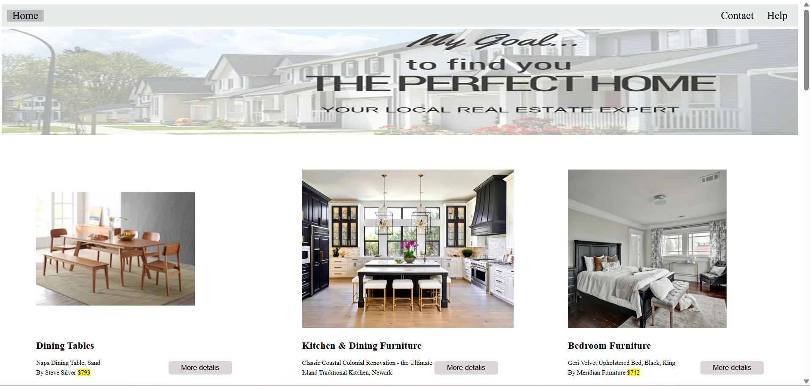

# 🏡 Your Perfect Home

A simple and elegant landing page for a fictional home design and decoration service.  
This project was built as part of my learning journey in Front-End Development using *HTML5* and *CSS3*.

---

## 📌 Project Features

- Clean and responsive design
- Structured HTML5 elements
- Custom CSS styling
- Organized file structure
- Easy to customize and expand

---

## 🛠 Technologies Used

- HTML5
- CSS3
- Google Fonts
- Images & Icons

---

## 📸 Screenshot

---

## 🚀 Live Demo

🔗 [Click here to view the website](https://fatmamagdi.github.io/Your-Perfect-Home/)

---

## 🧠 Author

*Fatma Magdi*  
Front-End Developer | Career Shifter | Learning & Growing Every Day  
[My LinkedIn](https://www.linkedin.com/in/fatma-magdi270398)

---

> 💡 This is one of my first projects, and I’m continuously improving. Feedback is always welcome!
